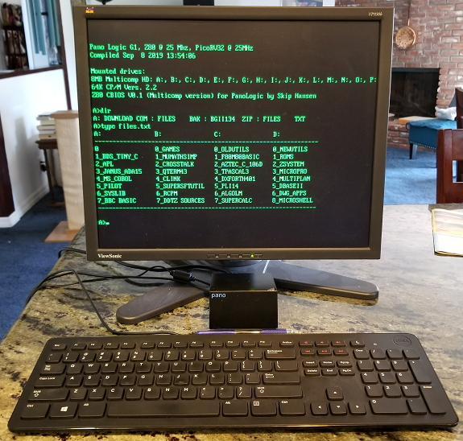
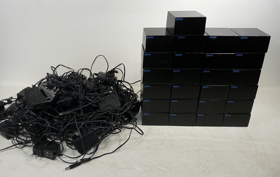
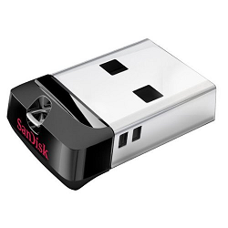

# Retro Z80 computer for the Panologic Thin Client
 

This project creates a Z80 based computer from a Panologic thin client by 
loading a new bit image into the Pano FPGA, no other modifications are needed.

Features:

- 25Mhz Z80 with 64K RAM
- USB keyboard and VGA monitor for console 
- USB flash drive provides storage of multiple Floppy and hard disks images
- Compatible with disk images created for the [z80pack](https://www.autometer.de/unix4fun/z80pack/) project
- Compatible with disk images created for the [Multicomp](http://searle.wales//Multicomp/cpm/fpgaCPM.html) project
- ANSI support for keyboard and monitor
- Function key selection of retro "Green Screen" or normal screen modes
- Function key selection of retro or normal control key placement
- RISC-V I/O co-processor
- No soldering required!

## What is a Panologic device and why do I care?

Panologic was a Bay Area startup that manufactured tiny thin clients that 
were connected to a central server.  The Pano devices have a Ethernet 
interface, a few USB ports, audio input and output ports, and one or two 
video ports.  

The first generation (G1) Pano was based on the largest Xilinx Spartan-3E 
family chip and supported a single VGA monitor.  

The second generation (G2) supported two DVI monitors.  Revision A and B 
of the G2 devices were based on the Spartan-6 LX150 which is the largest 
chip in the family.  The revision C G2 device is based on the smaller 
LX100 device which is still quite large by hobbist standards.  

Unfortunately for Panologic, but fortunate for FPGA hobbyists Panologic 
went out of business in 2012.  Shortly thereafter **TONS** of both new and 
used Panologic devices started showing up on ebay for very little money 
since they were pretty much useless without support.  Even today (Aug
2020) both versions of the Panologic devices are still readily available 
on ebay for little. 

 

Tom Verbeure has spent a lot of time reverse engineering the Panologic 
devices and created an absolute mind blowing raytracing demo that runs on a 
G1 device.  It was the [Hackaday article](https://hackaday.com/2018/12/07/racing-the-beam-on-a-thin-client-in-fpgas/) article on his project that originally 
attracted my attention to the Pano hacking scene.  

Tom's article also got the attention of Wenting Zhang who added support 
for the G1's SDRAM and USB controller as well as making it possible to 
execute code on a soft processor directly from the SPI flash.  

This project was derived directly from his [Verilog Boy](https://hackaday.io/project/57660-verilogboy-gameboy-on-fpga) project.

## Disk I/O


Disk I/O is provided by a USB flash drive. Multiple CP/M floppy and hard disk 
images can be stored on a single drive. 

The standard FAT filesystem is used so there is no need to use special tools 
to write images to the drive.

Disk images for the z80pack project can be copied to the USB flash drive and
booted directly without any additional configuration.

## Console
A classic VT100 "Green Screen" terminal is emulated using a VGA monitor and
a USB keyboard.  A sufficient subset of the ANSI cursor positioning escape
sequences have been implemented to support CP/M programs such as WordStar and 
WordMaster.

Characters are displayed as green on black again to match legacy monochrome 
monitors.   To provide a closer match to keyboard layouts that were common in 
the 70's and early 80's the caps lock and left control keys are swapped.

The keys in the numeric keyboard and function keys F1..F4 generate appropriate 
ANSI escape sequences for programs that might support them. None of the other 
non-ASCII keys are passed to the Z80 console.

Function keys F5 .. F12 are used by the RISC-V I/O processor to provide run
time control of the system. 

F5 is used to swap the position of the control and caps lock keys.

F6 is used to toggle the display between green on black, white on black, or 
black on white.  

F7 is used to reset Z80 processor.

## HW Requirements

* A first generation Panologic thin client (G1, the one with a VGA port)
* A suitable 5 volt power supply
* A USB keyboard
* A USB Mass storage device
* A JTAG programmer to load the bitstream and program code into flash

## Software Requirements

To program the supplied binary files you use either [xc3sprog](http://xc3sprog.sourceforge.net/)
or iMPACT included with Xilinx ISE 14.7.  

To say the very least xc3sprog is a smaller download, but you will need 
to built it from sources for your system.  I recommend that you install it 
even if you already have installed ISE. I have found xc3sprog to be easier to 
use, faster, and more reliable than iMPACT.

If you would like to modify fpga portion of the project you will definitely
need to download and install ISE.

The free Webpack version of Xilinx [ISE 14.7](https://www.xilinx.com/support/download/index.html/content/xilinx/en/downloadNav/vivado-design-tools/archive-ise.html) is used for development.
Do **NOT** download the latest Windows 10 version as it does not support the 
Spartan 3E family of chips used in the first generation of the Pano device.

## Installation

Installation is done in two parts.  First we prepare a USB flash drive for 
booting and running the Z80, then we update the Pano's flash with a new
image.  The image includes the bit stream for the FPGA as well as firmware for 
the RISC-V I/O processor.

Start out by cloning the [pano_z80](https://github.com/skiphansen/pano_z80.git) repository and changing directory into it.

```
skip@dell-790:~/pano/working/$ git clone https://github.com/skiphansen/pano_z80.git
Cloning into 'pano_z80'...
remote: Enumerating objects: 345, done.
remote: Total 345 (delta 0), reused 0 (delta 0), pack-reused 345
Receiving objects: 100% (345/345), 9.29 MiB | 6.91 MiB/s, done.
Resolving deltas: 100% (173/173), done.
skip@dell-790:~/pano/working/$ cd pano_z80
skip@dell-790:~/pano/working/pano_z80$ 
```

### USB drive selection

The storage capacity of the USB flash drive isn't important, it's literally 
impossible to buy a drive that's too small these days. A 256 mb (not gigabyte!) 
drive is more than sufficient.

The exact degree of USB flash drive compatibility of the USB subsystem
is unknown, but it is expected to be reasonable. I have tested with several 
different devices and they all work, but they were are all "Bulk/Bulk/Bulk" 
type devices at the low level.  "Control/Bulk" and "Control/Bulk/Interrupt" 
type devices also exist, but I haven't found any to test with.

If a flash drive isn't recognized or doesn't work try a different one.

If you are worried about compatibility the specific device I'm using
is a [SanDisk Cruzer](https://www.amazon.com/gp/product/B005FYNSZA/ref=ppx_yo_dt_b_search_asin_title?ie=UTF8&psc=1) because it's tiny, cheap and a "name brand".

### USB drive preparation

Unlike more modern operating systems the disk layout is not written to
the media itself, it's hardcoded in the CBIOS.  Hence drive mappings are 
defined by the image that is used to boot CP/M.  

Disk images created for either the [z80pack](https://www.autometer.de/unix4fun/z80pack/) or [Multicomp](http://searle.wales//Multicomp/cpm/fpgaCPM.html) projects or a mix of both can be used.
There are a huge number of disk images are available for download from the 
z80pack project web page.  I've also found a couple of Multicomp images that 
contain massive collections of CP/M software. 

The z80pack project uses one disk image per drive.  The stock z80pack CP/M 2.2 
CBIOS supports four 241K 8 inch SSSD floppies and two 4mb hard disks.  Z80pack
disk images have an extension of ".dsk".

Since the Pano_z80 I/O system implements the I/O ports as defined by the z80pack 
project's drivea.dsk the disk images may be booted directly.  

The Multicomp project uses one image file per system which emulates 16 8mb CP/M 
hard disks (A: to P:).  Multicomp disk images have an extension of ".img".

Since the Pano_z80 I/O system is not compatible with Multicomp's CBIOS 
Multicomp images can not be booted directly.  Rather than replacing the system 
tracks of the Multicomp image with a compatible CBIOS a separate boot image is 
used for booting.

Two boot images are provided to support Multicomp images, one provides access
to all 16 drives within the Multicomp image while the other supports a 
combination of Multicomp and z80pack images.

There are 3 boot options to chose from:

| Option | Boot disk  | Floppies | Z80pack 4mb HD | Multicomp 8mb HD |
|--------|------------|----------|----------------|------------------|
|   1    | drivea.dsk | A: -> D: |     I: , J:    |                  |
|   2    | boot.dsk   |          |                |    A: -> P:      |
|   3    | dual.dsk   | G: -> H: |     I: , J:    |    A: -> F:      |

The drive mappings for the first two boot options are the same as the original 
projects.  This provides compatibility with submit jobs from those
projects which assume certain disk mappings.

Boot option #3 allows images from both projects to be mounted simultaneously,
however Multicomp drives G: -> P: are not be mounted and are not accessible.

If multiple boot disk images are present on the USB drive the user will be
asked to select the desired configuration when the system is booted.

If multiple Multicomp disk images (.img) are present on the USB drive the 
user will be asked to select the desired configuration image when the 
system is booted.

### Boot option #1 - Z80Pack images only

Clone the [z80pack](https://github.com/udo-munk/z80pack.git) repository and copy 
.../z80pack/cpmsim/disks/library/cpm2-1.dsk to the root directory of the USB 
flash drive naming it "DRIVEA.DSK".  This is the CP/M boot disk and it 
must present.

Copy any other desired floppy disk images to "DRIVEB.DSK", "DRIVEC.DSK", and 
"DRIVED.DSK".  Copy any desired hard disk images to "DRIVEI.DSK" and 
"DRIVEJ.DSK".

Warning: If the wrong image type is mounted on drive nothing good is likely 
to happen!

### Boot option #2 - Multicomp images only

Copy .../pano_z80/fw/z80/srccpm2/boot.dsk to the root directory of the USB 
flash drive.  This is the CP/M boot disk and it must present. Note: this image 
is only used for booting CP/M, it will not be mounted and will not be visible 
to CP/M.

Copy the desired Multicomp disk image(s) to the root directory of the USB flash 
drive.  These image(s) must have an extension of ".img".

### Boot option #3 - Combination

Copy .../pano_z80/fw/z80/srccpm2/dual.dsk to the root directory of the USB 
flash drive.  This is the CP/M boot disk and it must present.  Note: this
image is only used for booting CP/M, it will not be mounted and will not
be visible to CP/M.

Copy any desired floppy images to the root directory of the USB flash 
drive naming them "DRIVEG.DSK" and "DRIVEH.DSK", copy any desired z80pack 4mb 
hard disk images to "DRIVEI.DSK" and "DRIVEJ.DSK".

Copy the desired Multicomp disk image(s) to the root directory of the USB flash 
drive naming.  The images must have an extension of ".img".

### Programming the Pano flash using xc3sprog

Install xc3sprog for your system.  If a binary install isn't available for your
system the original project can be found here: https://sourceforge.net/projects/xc3sprog/.
Sources can be checked out using subversion from https://svn.code.sf.net/p/xc3sprog/code/trunk.

As an alternate if you don't have subversion a fork of the original project
can be found here: https://github.com/Ole2mail/xc3sprog.git .

If your JTAG cable is not a Digilent JTAG-HS2 cable then you will need to edit 
the toplevel Makefile and change XC3SPROG_OPTS for your device.

Refer to the supported hardware [web page](http://xc3sprog.sourceforge.net/hardware.php) page or run  xc3sprog -c 
to find the correct cable option for your device.

Now that hard part is over, just run make to flash the new Xilinx bit stream 
and firmware image

```
skip@dell-790:~/pano/working/pano_z80$ make
xc3sprog -c jtaghs2 -v -I./fpga/xc3sprog/pano_g1.bit ./xilinx/pano_z80.mcs:W:0:MCS
XC3SPROG (c) 2004-2011 xc3sprog project $Rev: 774 $ OS: Linux
Free software: If you contribute nothing, expect nothing!
Feedback on success/failure/enhancement requests:
        http://sourceforge.net/mail/?group_id=170565
Check Sourceforge for updates:
        http://sourceforge.net/projects/xc3sprog/develop

Using built-in device list
Using built-in cable list
Cable jtaghs2 type ftdi VID 0x0403 PID 0x6014 Desc "Digilent USB Device" dbus data e8 enable eb cbus data 00 data 60
Using Libftdi, Using JTAG frequency   6.000 MHz from undivided clock
JTAG chainpos: 0 Device IDCODE = 0x21c3a093     Desc: XC3S1600E
Created from NCD file: top.ncd;UserID=0xFFFFFFFF
Target device: 3s1600efg320
Created: 2019/08/11 16:06:27
Bitstream length: 5969696 bits
done. Programming time 1022.5 ms
JEDEC: 20 20 0x14 0x10
Found Numonyx M25P Device, Device ID 0x2014
256 bytes/page, 4096 pages = 1048576 bytes total
Created from NCD file:
Target device:
Created:
Bitstream length: 6764640 bits
Erasing sector 13/13....Writing data page   3303/  3304 at flash page   3303..
Maximum erase time 635.4 ms, Max PP time 63536 us
Verifying page   3304/  3304 at flash page   3304
Verify: Success!
USB transactions: Write 16761 read 16394 retries 17404
xc3sprog -c jtaghs2 -v ./xilinx/work/pano_top.bit
XC3SPROG (c) 2004-2011 xc3sprog project $Rev: 774 $ OS: Linux
Free software: If you contribute nothing, expect nothing!
Feedback on success/failure/enhancement requests:
        http://sourceforge.net/mail/?group_id=170565
Check Sourceforge for updates:
        http://sourceforge.net/projects/xc3sprog/develop

Using built-in device list
Using built-in cable list
Cable jtaghs2 type ftdi VID 0x0403 PID 0x6014 Desc "Digilent USB Device" dbus data e8 enable eb cbus data 00 data 60
Using Libftdi, Using JTAG frequency   6.000 MHz from undivided clock
JTAG chainpos: 0 Device IDCODE = 0x21c3a093     Desc: XC3S1600E
Created from NCD file: pano_top.ncd;HW_TIMEOUT=FALSE;UserID=0xFFFFFFFF
Target device: 3s1600efg320
Created: 2019/10/15 09:03:47
Bitstream length: 5855264 bits
done. Programming time 1000.1 ms
USB transactions: Write 366 read 7 retries 8
skip@dell-790:~/pano/working/pano_z80$
```

### Programming the Pano flash using iMPACT

Use iMPACT to program .../xilinx/pano_z80.msc into flash.

1. Start iMPACT (Selecting Tools/iMPACT from ISE's menu is one way).
2. Double click "Boundary Scan" under iMPACT flows.
3. Right click in the Boundary Scan window and select Initialize chain.
4. Dismiss the Auto Assign dialog box by clicking No.
5. Click Ok on the Device Programming properties dialog.
6. Right click the "SPI/BPI ?" box shown above the Xilinx chip and select 
"Add SPI/BPI flash"
7. Navigate to .../xilinx/pano_z80.msc and click Open.
8. Select "M25P80" from the drop down box on the dialog and click OK.
9. Right click the "Flash" box shown above the Xilinx chip and select 
"program".
10. Click OK on the Device Programming Properties dialog.
11. Cross fingers and hope that the program operation will be successful.

## Booting CP/M

Now that the Pano has been updated and a USB flash drive is ready it's time
for the moment of truth.  Connect a USB keyboard and the USB flash drive to
the USB ports next to the VGA connector and connect a VGA monitor.  Do not use 
the USB port located next to the Ethernet port, it does not work currently 
(a bug for another day).

Now turn on power and hopefully you'll be greeted by a screen similar to
the one at the top of this page.

I've played around with a few CP/M programs briefly and most of what I tried
worked fine, however the paint on this project is most definitely still wet.
If you find any issues please file a ticket, or better yet fix them and send
me pull requests!

## Building Everything from Scratch

**NB:** While it may be possible to use Windows for development I haven't 
tried it and don't recommend it.

* Install the free Webpack version of Xilinx [ISE 14.7](https://www.xilinx.com/support/download/index.html/content/xilinx/en/downloadNav/design-tools/v2012_4---14_7.html)

* Follow the instruction in the [PicoRV32 repository](https://github.com/cliffordwolf/picorv32#building-a-pure-rv32i-toolchain) to install the riscv32ic toolchain.

* Clone this github repository into `~/pano_z80` and change into the root of the repository

* Build the firmware for the RISC-V processor

```
(cd fw/firmware/;make)
```
This creates the file `~/pano_z80/fw/firmware/firmware.bin`

* Fire up Xilinx ISE

* Create the bitstream `~/pano_z80/xilinx/work/pano_top.bit`
    * File -> Open Project -> ~/pano_z80/xilinx/pano_z80.xise
    * Double click on 'Generate Programming File'

* Create the MSC "prom" file with the bit stream and firmware image
    * Start iMPACT
    * Click "No" to "Automatically create and save a project"
    * Open the iMPACT Project file ~/pano_z80/xilinx/pano_z80.ipf
    * Double click "Generate File..." under iMPACT Processes 

This should create `~/pano_z80/xilinx/pano_z80.mcs`.

### Useful Make targets for development

These targets assumed you have installed xc3sprog, if you haven't, well ...
then these won't be very useful after all.

Run "Make prog" from .../sw/firmware to build and program JUST the RISC-V
image.  This provides a very fast build/debug/edit/build cycle by 
eliminating the need to touch ISE or iMPACT.  A typical build/flash takes
less than 10 seconds.  

Run "Make reload" to just reload the current .bit file into the Xilinx.  It
is NOT programmed into flash. This provides an easy way to reset the
FPGA and RISC-V processor.

Run "Make prog_fpga" to just flash the current .bit file into the SPI flash.

Run "Make prog_all" from the top level directory to flash the current .bit file
and RISC-V firmware.

### RISC-V firmware debugging

The RTL hardware includes a output only UART which can be used for debug 
output while debugging RISC-V firmware.   The debug serial port's format is 
115200-n-8-1.

Moderate soldering skills or good clip leads are needed to connect a 3.3V 
compatible serial port to the LED.  The LED trace is fairly easy to access,
please refer to my [pano_man](https://github.com/skiphansen/pano_man#gpio-joystick-interface)
documentation for the location.

The log.h header includes several macros to make debugging easier.  Please refer
to the source for details.

## History
The inspiration from this project was Grant Searle's [Multicomp](http://searle.wales//Multicomp/)
project. I bought an Cyclone II dev board shortly after discovering Grant's
web site a few years ago, but I never got around to doing anything with it.
The needed wiring wasn't difficult nor were the parts expensive or hard to find
but laziness won the day.

Last year Tom Verbeure's ray tracer [project](https://github.com/tomverbeure/rt) 
caught my eye and I bought a "few" PanoLogic devices and actually started to do
stuff with them.

The Pano devices have a huge potential as a hobbyist device but it's also a
steep hill to climb.  Luckily I didn't have to climb it alone or my Pano would
probably also be sitting around untouched.

I had initially planned on designing my own I/O system like Grant had and then
writing a CBIOS to support it.  I couldn't use Grant's CBIOS directly since I
wanted to use USB flash drives instead of the SD cards that Grant used.  However
once I discovered the z80pack project I decided to leverage Udo Munk's CBIOS
by implementing his I/O system design in hardware.  I'm sure this decision
saved me hundreds of hours of frustration.

If you build/use/modify this project I'd enjoy hearing about it.  You can find 
my email address in the git log.  

## Acknowledgement and Thanks

Tom Verbeure's reverse engineering efforts and Panologic [bring up](https://github.com/tomverbeure/panologic) code made it possible
to get projects up and running rapidly without the reverse engineering drudgery.
Without Tom's work I would still be thinking of getting involved with FPGAs
"some day".

I started this project by cloning Wenting Zhang's [VerilogBoy](https://github.com/zephray/VerilogBoy)
project and then replacing the Gameboy portion with a Z80.  

Wenting's contributions of bringing up the LPDDR Ram and USB subsystems on the 
first generation Panologic device has opened up a window of possibilities 
for Pano hacking immeasurably. Mr Zhang has my sincere thanks and admiration 
for his brilliant work.

This project also uses code from several other projects including:

 - [https://github.com/cliffordwolf/picorv32](https://github.com/cliffordwolf/picorv32)
 - [https://github.com/u-boot/u-boot](https://github.com/u-boot/u-boot)
 - [https://github.com/MParygin/v.vga.font8x16](https://github.com/MParygin/v.vga.font8x16)
 - [Daniel Wallner's Z80 CPU core](https://opencores.org/projects/t80)
 - [ChaN's FatFs](http://elm-chan.org/fsw/ff/00index_e.html)
 - [Martin K. Schröder's VT100](https://github.com/mkschreder/avr-vt100)

## CP/M software links

- CP/M demo disk from [Obsolescence Guaranteed](https://obsolescence.wixsite.com/obsolescence/multicomp-fpga-cpm-demo-disk)
- Software for the [LiNC80](http://linc.no/products/linc80-sbc1/software-for-the-linc80/)
- The [HUMONGOUS](http://www.classiccmp.org/cpmarchives/) CP/M software Archives
- The [Unofficial CP/M Web site](http://www.cpm.z80.de/)
- The [Retrocomputing Archive](http://www.retroarchive.org/)


## Pano Links

Links to other Panologic information can be found on the [Pano Hacker's Wiki](https://github.com/tomverbeure/panologic-g2/wiki#community)

## LEGAL 

My original work (the CP/M I/O system) is released under the GNU 
General Public License, version 2.

My version of CBIOS is based on Udo Munk's original work, which was published 
with the following license:
>Copyright (c) 1987-2016 Udo Munk

>Permission is hereby granted, free of charge, to any person
obtaining a copy of this software and associated documentation
files (the "Software"), to deal in the Software without
restriction, including without limitation the rights to use,
copy, modify, merge, publish, distribute, sublicense, and/or sell
copies of the Software, and to permit persons to whom the
Software is furnished to do so, subject to the following
conditions:

> The above copyright notice and this permission notice shall be
included in all copies or substantial portions of the Software.

> THE SOFTWARE IS PROVIDED "AS IS", WITHOUT WARRANTY OF ANY KIND,
EXPRESS OR IMPLIED, INCLUDING BUT NOT LIMITED TO THE WARRANTIES
OF MERCHANTABILITY, FITNESS FOR A PARTICULAR PURPOSE AND
NONINFRINGEMENT. IN NO EVENT SHALL THE AUTHORS OR COPYRIGHT
HOLDERS BE LIABLE FOR ANY CLAIM, DAMAGES OR OTHER LIABILITY,
WHETHER IN AN ACTION OF CONTRACT, TORT OR OTHERWISE, ARISING
FROM, OUT OF OR IN CONNECTION WITH THE SOFTWARE OR THE USE OR
OTHER DEALINGS IN THE SOFTWARE.

My version of CBIOS also includes portions of Grant Searle's original work, 
which was published with the following license:

>"By downloading these files you must agree to the following: The original 
copyright owners of ROM contents are respectfully acknowledged. Use of the 
contents of any file within your own projects is permitted freely, but any 
publishing of material containing whole or part of any file distributed here, 
or derived from the work that I have done here will contain an 
acknowledgement back to myself, Grant Searle, and a link back to this page. 
Any file published or distributed that contains all or part of any file 
from this page must be made available free of charge. 
(http://searle.wales//Multicomp/index.html).

>All the project files (SW & HW) are licensed under GPL v3.

This project was derived directly form Wenting Zhang's Verilog Boy project 
which was released under the GPL version 2. license.

Wenting further acknowledged the following:

>The PicoRV32 is free and open hardware licensed under the [ISC license](http://en.wikipedia.org/wiki/ISC_license)
(a license that is similar in terms to the MIT license or the 2-clause BSD license).

>Some firmware code of pano-g1 target are released to public domain.

>All other software codes are licensed under GNU GPL 2.0.

>All other HDL codes are licensed under OHDL 1.0.

>All other text documents are licensed under CC BY-SA 4.0


>If you use this material in any way a reference to the author (me :-) ) 
will be appreciated.

